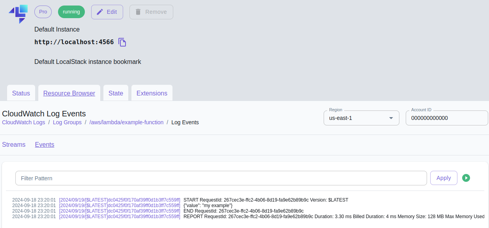
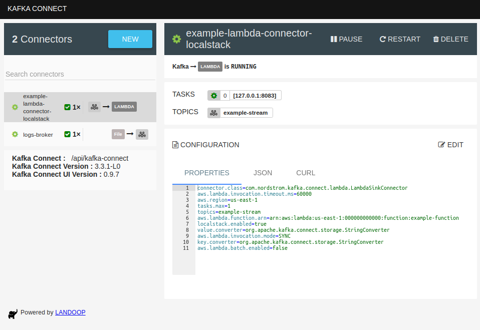
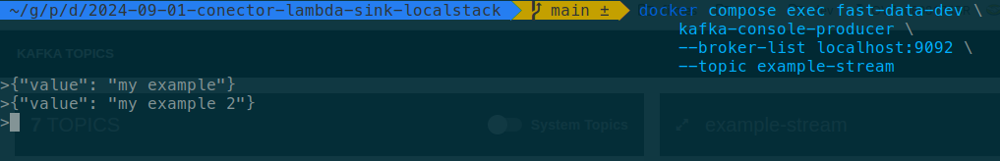
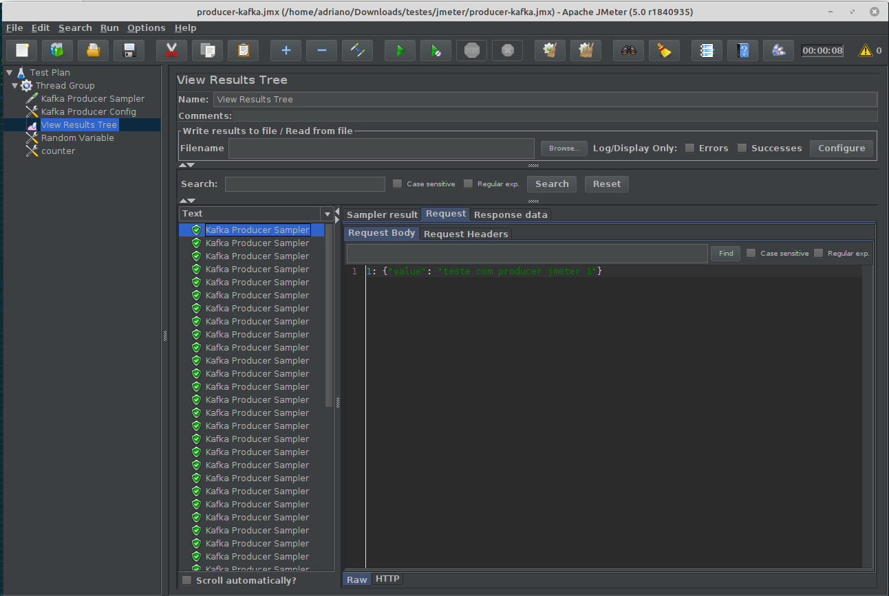

## Introdução
Ao trabalhar em projetos corporativos, é comum mover informações de um lugar para outro utilizando o Kafka e seus conectores *source* e *sink*. Os conectores *source* são responsáveis por enviar dados aos tópicos Kafka, enquanto os conectores **sink** exportam essas informações para sistemas externos, como bancos de dados, ferramentas de log ou serviços na AWS, como uma *Lambda*. Neste tutorial, abordaremos especificamente o conector *sink*, mais precisamente o **Lambda Sink Connector**, utilizando o [Localstack](https://www.localstack.cloud/) para simular o serviço AWS Lambda.

## Pré-requisitos
Antes de começar, certifique-se de ter os seguintes itens configurados no seu ambiente:

- **Docker**: para criar os containers que rodarão o Kafka e o Localstack.
- **Docker Compose**: para orquestrar os containers.
- **[AWS CLI](https://docs.aws.amazon.com/pt_br/cli/latest/userguide/getting-started-install.html)**: necessário para executar comandos relacionados à AWS.
- **cURL ou uma ferramenta similar como o Insomnia**: para realizar requisições HTTP.
- Arquivo de configuração AWS (`~/.aws/config`) configurado da seguinte forma:

```bash
[default]
region = us-east-1
output = json
```

## Sobre o projeto
O objetivo deste projeto é simular um ambiente corporativo usando Kafka e AWS Lambda, de forma acessível e sem custos, utilizando o [Localstack](https://www.localstack.cloud/). Isso permite que você emule serviços da AWS localmente, facilitando o desenvolvimento e testes.

No fluxo deste projeto, uma mensagem é enviada por um **producer** para um tópico Kafka, que por sua vez dispara um evento para o conector Kafka Sink. O conector envia essa mensagem para uma função Lambda, conforme ilustrado no diagrama abaixo:


Para isso, utilizaremos o **Docker Compose** para gerenciar os containers do Kafka e do Localstack. A imagem Docker **fast-data-dev** será usada para o Kafka, pois já inclui uma interface gráfica e ferramentas como **Zookeeper**, **Kafka Cluster**, **Schema Registry** e **Kafka Connect**. O Localstack será usado para emular serviços da AWS, incluindo a Lambda.

Se você preferir uma visualização gráfica da Lambda em execução, o Localstack possui uma [interface web](https://docs.localstack.cloud/user-guide/web-application/). Além disso, existe um [vídeo introdutório sobre o Localstack no YouTube](https://www.youtube.com/watch?v=1ow0NQv5Fsk), caso queira entender mais sobre a ferramenta.


_Tela da interface gráfica do Localstack Web mostrando os logs de execução de uma Lambda._

Para configurar o Kafka Connect, utilizaremos o [plugin Lambda Sink](https://github.com/adrianoavelino/kafka-connect-lambda-localstack) que oferece suporte ao Localstack. Este plugin é um fork do projeto [kafka-connect-lambda](https://github.com/Nordstrom/kafka-connect-lambda), que não funciona com o Localstack. Caso tenha interesse em contribuir, a sua contribuição é bem-vinda!


_Tela da interface gráfica do fast-data-dev mostrando o conector Lambda Sink._

Para enviar mensagens ao tópico Kafka, usaremos um **producer**. Existem diversas opções para isso:

- **Linha de comando**: Usando o `kafka-console-producer` do container Kafka.
- **[Kafkacat](https://github.com/edenhill/kcat)**: Ferramenta de linha de comando para interagir com o Kafka.
- **JMeter com o plugin Kafka**: Veja mais detalhes na seção [Dicas e Recomendações](#Dicas-e-Recomendações).
- **Conector Data Source como o [Voluble](https://github.com/MichaelDrogalis/voluble)**.
- Criar uma aplicação customizada na sua linguagem de programação preferida.

Para simplificar, neste tutorial, utilizaremos o `kafka-console-producer`.


_Tela do terminal executando Kafka Console Producer na linha de comando_

## Criação dos arquivos de configuração
Antes de tudo começar a funcionar, é necessário criarmos os arquivos de configuração da infraestrutura do Kafka, Lambda e conector Lambda Sink. Vamos começar configurando o **Docker Compose** para orquestrar Kafka e LocalStack, seguido do **CloudFormation** para provisionar a função Lambda no Localstack. Em seguida, definimos o **conector Kafka** e baixamos o **plugin Lambda Sink**. Por fim, verificamos a **estrutura final do projeto**, listando os arquivos criados para garantir que estão no local correto e prontos para execução. Vamos nessa!

### Docker Compose
Começaremos criando o arquivo **docker-compose.yml**, que será responsável por orquestrar os containers do Kafka e do Localstack. Ele define os serviços necessários, como o Kafka (com a imagem **fast-data-dev**) e o Localstack para emular a AWS. Crie o arquivo `./docker-compose.yml` com o seguinte conteúdo:

```yml
services:
  fast-data-dev:
    image: landoop/fast-data-dev:3.3
    ports:
      - "2181:2181"
      - "3030:3030"
      - "8081-8083:8081-8083"
      - "9581-9585:9581-9585"
      - "9092:9092"
    environment:
      ADV_HOST: 127.0.0.1
      DEBUG: 1
      RUNTESTS: 0
      AWS_ACCESS_KEY_ID: local
      AWS_SECRET_ACCESS_KEY: local
      CONNECT_PLUGIN_PATH: /var/run/connect/connectors/stream-reactor,/var/run/connect/connectors/third-party,/connectors
    volumes:
      - ./plugins:/connectors/kafka-connect-lambda-localstack
    network_mode: host

  localstack:
    container_name: "${LOCALSTACK_DOCKER_NAME-localstack-main}"
    image: localstack/localstack:2.3
    ports:
      - "127.0.0.1:4566:4566"            # LocalStack Gateway
      - "127.0.0.1:4510-4559:4510-4559"  # external services port range
    environment:
      - DEBUG=${DEBUG-}
      - DOCKER_HOST=unix:///var/run/docker.sock
    volumes:
      - "${LOCALSTACK_VOLUME_DIR:-./volume}:/var/lib/localstack"
      - "/var/run/docker.sock:/var/run/docker.sock"
    depends_on: [fast-data-dev]
    network_mode: host
```

### CloudFormation
Agora, criaremos um arquivo **cloudformation.yml** para provisionar a função Lambda simulada no Localstack. O arquivo também define as permissões necessárias para a execução da Lambda. Crie o arquivo `./cloudformation.yml` com o seguinte conteúdo:
```yml
AWSTemplateFormatVersion: '2010-09-09'
Description: 'Lambda connector example function'
Resources:
  ExampleFunction:
    Type: AWS::Lambda::Function
    Properties:
      FunctionName: example-function
      Handler: index.handler
      Runtime: python3.7
      Role: !GetAtt 'ExampleFunctionRole.Arn'
      Code:
        ZipFile: |
          import json
          def handler(event, context):
            print(json.dumps(event))
            return event

  ExampleFunctionRole:
    Type: AWS::IAM::Role
    Properties:
      RoleName: example-lambda-role
      AssumeRolePolicyDocument:
        Version: '2012-10-17'
        Statement:
        - Effect: Allow
          Principal:
            Service: lambda.amazonaws.com
          Action: sts:AssumeRole
      ManagedPolicyArns:
      - arn:aws:iam::aws:policy/service-role/AWSLambdaBasicExecutionRole

Outputs:
  ExampleFunctionArn:
    Value: !GetAtt 'ExampleFunction.Arn'
  ExampleFunctionRoleArn:
    Value: !GetAtt 'ExampleFunctionRole.Arn'
```

### Configuração do conector Kafka
Agora, crie o arquivo de configuração do **conector Lambda Sink**. Este arquivo define as propriedades do conector, incluindo o tópico Kafka e a função Lambda a ser invocada. Crie o arquivo `./connector-localstack.json` com o seguinte conteúdo:
```json
{
  "name": "example-lambda-connector-localstack",
  "config": {
    "tasks.max": "1",
    "connector.class": "com.nordstrom.kafka.connect.lambda.LambdaSinkConnector",
    "topics": "example-stream",
    "key.converter": "org.apache.kafka.connect.storage.StringConverter",
    "value.converter": "org.apache.kafka.connect.storage.StringConverter",
    "aws.region": "us-east-1",
    "aws.lambda.function.arn": "arn:aws:lambda:us-east-1:000000000000:function:example-function",
    "aws.lambda.invocation.timeout.ms": "60000",
    "aws.lambda.invocation.mode": "SYNC",
    "aws.lambda.batch.enabled": "false",
    "localstack.enabled": "true"
  }
}
```

### Download do plugin Lambda Sink
Por fim, faça o **download do plugin Lambda Sink** e salve-o no diretório `./plugins`. Execute o seguinte comando no terminal:
```bash
curl -L -o ./plugins/kafka-connect-lambda-localstack-1.4.0.jar \
https://github.com/adrianoavelino/kafka-connect-lambda-localstack/releases/download/v1.4.0/kafka-connect-lambda-localstack-1.4.0.jar
```
> A última versão do plugin é a [1.4.0](https://github.com/adrianoavelino/kafka-connect-lambda-localstack/releases/tag/v1.4.0). Para versões mais recentes, consulte as [releases no GitHub](https://github.com/adrianoavelino/kafka-connect-lambda-localstack/releases).

### Estrutura final do projeto
Ao finalizar esta etapa, a estrutura de arquivos do projeto deverá ser semelhante a esta:
```
.
├── cloudformation.yml
├── connector-localstack.json
├── docker-compose.yml
├── plugins
│   └── kafka-connect-lambda-localstack-1.4.0.jar
```

## Criação da infrastrutura
Para que nossa aplicação comece a funcionar, precisamos preparar o terreno: vamos criar a infraestrutura que dará vida ao Kafka, à Lambda e ao conector Lambda Sink.

Iniciaremos com a inicialização dos containers. Em seguida, provisionaremos a função Lambda usando o **CloudFormation**. Depois, criaremos o **conector Kafka**.

Por fim, vamos conferir se tudo foi criado corretamente. Preparados? Então, vamos lá!

### Inicialização dos containers
Inicie os containers do Kafka e do Localstack com o seguinte comando:
```bash
docker compose up -d
```

> Se você é uma pessoa como eu que adora acompanhar o passo a passo de cada informação nos logs, é possível utilizar o comando `docker compose logs -f`.

Para garantir que tudo está funcionando como devia, podemos realizar algumas verificações:
- `docker compose ps`: para validar se os containers estejam no estado `healthy`
- Acesse o endereço [http://localhost:3030/](http://localhost:3030/) para acessar a interface gráfica do Landoop para visualizar os tópicos, conectores e plugins dos conectores instalados.
- `curl --url http://localhost:8083/connector-plugins/`: listas os plugins de conectores disponíveis, verifique se o plugin com a class `com.nordstrom.kafka.connect.lambda.LambdaSinkConnector` está disponível.

### Criação da lambda
Crie uma Lambda no Localstack utilizando **Cloudformation** com seguinte comando:
```bash
aws cloudformation create-stack \
--stack-name example-lambda-stack \
--capabilities CAPABILITY_NAMED_IAM \
--template-body file://cloudformation.yml \
--endpoint-url http://localhost:4566
```

Se a stack for criada com sucesso, a saída será semelhante a esta:
```bash
{
    "StackId": "arn:aws:cloudformation:us-east-1:000000000000:stack/example-lambda-stack/d61cbd21"
}
```

Para verificar se a Lambda foi criada corretamente, execute:
```bash
aws lambda list-functions --endpoint-url=http://localhost:4566
```

A saída esperada será semelhante ao exemplo abaixo:
```json
{
    "Functions": [
        {
            "FunctionName": "example-function",
            "FunctionArn": "arn:aws:lambda:us-east-1:000000000000:function:example-function",
            "Runtime": "python3.7",
            "Role": "arn:aws:iam::000000000000:role/example-lambda-role",
            "Handler": "index.handler",
            "CodeSize": 1630,
            "Description": "",
            "Timeout": 3,
            "MemorySize": 128,
            "LastModified": "2024-09-09T01:17:54.471773+0000",
            "CodeSha256": "qDSOE5NTun0FiK+cFAAZGHPqarSjlyJtlGMCPPRpJ8Y=",
            "Version": "$LATEST",
            "TracingConfig": {
                "Mode": "PassThrough"
            },
            "RevisionId": "debe4c55-40b0-46e3-94b4-acfc1aeb17fb",
            "PackageType": "Zip",
            "Architectures": [
                "x86_64"
            ],
            "EphemeralStorage": {
                "Size": 512
            },
            "SnapStart": {
                "ApplyOn": "None",
                "OptimizationStatus": "Off"
            }
        }
    ]
}
```

Para testar a Lambda, use o seguinte comando:
```bash
aws lambda invoke --function-name example-function \
--cli-binary-format raw-in-base64-out \
--payload '{"value": "my example"}' --output text result.txt \
--endpoint-url http://localhost:4566
```

Se tudo ocorreu bem, você deve receber a seguinte resposta:
```bash
$LATEST Unhandled       200
```

### Criação do conector
A criação do conector Lambda Sink pode ser feita via [API Kafka Connect REST](https://docs.confluent.io/platform/current/connect/references/restapi.html) ou pela interface gráfica do [Landoop](http://localhost:3030/). Neste exemplo, utilizaremos o `curl` para enviar as requisições, mas você também pode usar ferramentas como o [Insomnia](https://insomnia.rest/download) ou similares.

```bash
curl -XPOST -H "Content-Type: application/json" \
http://localhost:8083/connectors \
-d @connector-localstack.json
```
> Dica: No Insomnia, você pode importar comandos **curl** para gerar a requisição automaticamente. Confira este [vídeo tutorial](https://www.youtube.com/watch?v=wGzQrWcUcjc) ou consulte a [documentação oficial](https://docs.insomnia.rest/insomnia/import-export-data#import-data) para mais detalhes.

Você deve receber a seguinte resposta:
```json
{
  "name": "example-lambda-connector-localstack",
  "config": {
    "tasks.max": "1",
    "connector.class": "com.nordstrom.kafka.connect.lambda.LambdaSinkConnector",
    "topics": "example-stream",
    "key.converter": "org.apache.kafka.connect.storage.StringConverter",
    "value.converter": "org.apache.kafka.connect.storage.StringConverter",
    "aws.region": "us-east-1",
    "aws.lambda.function.arn": "arn:aws:lambda:us-east-1:000000000000:function:example-function",
    "aws.lambda.invocation.timeout.ms": "60000",
    "aws.lambda.invocation.mode": "SYNC",
    "aws.lambda.batch.enabled": "false",
    "localstack.enabled": "true",
    "name": "example-lambda-connector-localstack"
  },
  "tasks": [],
  "type": "sink"
}
```

Para validar o status do conector, execute o seguinte comando **curl**:
```bash
curl --request GET \
  --url http://localhost:8083/connectors/example-lambda-connector-localstack/status 
```

A resposta deve se algo como:
```json
{
  "name": "example-lambda-connector-localstack",
  "connector": {
    "state": "RUNNING",
    "worker_id": "127.0.0.1:8083"
  },
  "tasks": [
    {
      "id": 0,
      "state": "RUNNING",
      "worker_id": "127.0.0.1:8083"
    }
  ],
  "type": "sink"
}
```
> **Observação:** Este comando também pode ser utilizado para diagnosticar problemas de integração entre o conector Kafka e a Lambda no Localstack.

## Enviar mensagem no kafka
Agora que tudo está configurado e em execução, é hora de fazer o Kafka funcionar de verdade! Vamos aprender a enviar mensagens para o tópico que criamos. Neste momento, vamos explorar duas opções para enviar mensagens: uma forma rápida e direta para quem precisa de agilidade e outra que permite o envio contínuo de múltiplas mensagens. Com essas opções, você poderá interagir facilmente com o Kafka e começar a testar a comunicação entre os componentes da sua aplicação. Vamos lá!

### Opção 1: Envio rápido de mensagem única
Utilize o comando abaixo para enviar uma mensagem única ao Kafka de forma rápida:
```bash
echo "teste" | docker compose exec -T fast-data-dev \
kafka-console-producer \
--broker-list localhost:9092 \
--topic example-stream
```
> Obs: em caso de problema de comunicação com o broker ou outro serviço utilize o comando: `nc -vz localhost <PORTA>`. Ex: `nc -vz localhost 9092`

### Opção 2: Envio contínuo de mensagens
Se preferir manter um terminal ativo para enviar várias mensagens ao Kafka, utilize o seguinte comando:
```bash
docker compose exec fast-data-dev \
kafka-console-producer \
--broker-list localhost:9092 \
--topic example-stream
```

Após a execução, você verá o prompt `>`, onde poderá inserir várias mensagens ao tópico Kafka. Exemplo de mensagens:
```bash
{"value": "my example"}
{"value": "my example 2"}
```

## Como visualizar os logs da Lambda no terminal
Para visualizar os logs da execução da Lambda diretamente no terminal, siga os passos abaixo:

1. Primeiro, obtenha o nome do grupo de logs da Lambda:
```bash
LOG_GROUP=`aws logs describe-log-groups \
--endpoint-url http://localhost:4566 \
--query "logGroups[0].logGroupName" | sed 's/"//g'`
```

2. Depois, use o comando aws logs tail para seguir os logs em tempo real:
```bash
aws logs tail $LOG_GROUP --follow --endpoint-url http://localhost:4566
```

A resposta esperada é algo semelhante ao exempĺo abaixo:
```bash
2024-09-15T18:27:34.888000+00:00 2024/09/15/[$LATEST]57661289d19ebedfe4a6782395866989 START RequestId: 61ab5b4f-569a-4348-905b-b15ceadfcc26 Version: $LATEST
2024-09-15T18:27:34.902000+00:00 2024/09/15/[$LATEST]57661289d19ebedfe4a6782395866989 {"key": "", "keySchemaName": null, "value": "teste", "valueSchemaName": null, "topic": "example-stream", "partition": 0, "offset": 1, "timestamp": 1726424854776, "timestampTypeName": "CreateTime"}
2024-09-15T18:27:34.917000+00:00 2024/09/15/[$LATEST]57661289d19ebedfe4a6782395866989 END RequestId: 61ab5b4f-569a-4348-905b-b15ceadfcc26
2024-09-15T18:27:34.932000+00:00 2024/09/15/[$LATEST]57661289d19ebedfe4a6782395866989 REPORT RequestId: 61ab5b4f-569a-4348-905b-b15ceadfcc26	Duration: 7.85 ms	Billed Duration: 8 msMemory Size: 128 MB	Max Memory Used: 128 MB
```

> **Observação:** também é possível visualizar os logs da Lambda diretamente na [interface gráfica do Localstack](https://app.localstack.cloud/inst/default/resources).

## Automatização
Parabéns! Se você chegou até aqui, já percorreu um longo caminho e fez tudo manualmente  ou ... você foi uma pessoa "espertinha" e encontrou um atalho aqui para chegar no parque de diversão.

Aqui não vamos precisar criar os arquivos de configuração e nem a criação da infraestrutura de forma manual, tudo está automatizado. Seguindo os passo abaixo você terá o ambiente completo configurado para enviar mensagens ao tópico Kafka e validar os logs. Vamos a prática:

Clone o repositório:
```bash
git clone https://github.com/adrianoavelino/posts.git
```

Entre no diretório `automation`:
```bash
cd dev.to/2024-09-01-conector-lambda-sink-localstack/automation/
```

Inicie os containers:
```bash
docker compose up
```

Agora é só aguardar a inicialização e criação da lambda e conector Lambda Sink para inicar os testes. Se o procorreu como planejado, você deve ver algo parecido com o exemplo abaixo:
```bash
localstack-main  | ########### script 02 - Lambda function has been invoked ###########
fast-data-dev-1  | Sat 28 Sep 2024 02:15:31 AM UTC  Kafka Connect listener HTTP state:  000  (waiting for 200)
fast-data-dev-1  | Sat 28 Sep 2024 02:15:36 AM UTC  Kafka Connect listener HTTP state:  000  (waiting for 200)
fast-data-dev-1  | Sat 28 Sep 2024 02:15:41 AM UTC  Kafka Connect listener HTTP state:  000  (waiting for 200)
fast-data-dev-1  | Sat 28 Sep 2024 02:15:47 AM UTC  Kafka Connect listener HTTP state:  200  (waiting for 200)
fast-data-dev-1  | 
fast-data-dev-1  | --
fast-data-dev-1  | +> Creating Lambda Sink Connector with avro
fast-data-dev-1  | {"name":"example-lambda-connector-localstack","config":{"tasks.max":"1","connector.class":"com.nordstrom.kafka.connect.lambda.LambdaSinkConnector","topics":"example-stream","key.converter":"org.apache.kafka.connect.storage.StringConverter","value.converter":"org.apache.kafka.connect.storage.StringConverter","aws.region":"us-east-1","aws.lambda.function.arn":"arn:aws:lambda:us-east-1:000000000000:function:example-function","aws.lambda.invocation.timeout.ms":"60000","aws.lambda.invocation.mode":"SYNC","aws.lambda.batch.enabled":"false","localstack.enabled":"true","name":"example-lambda-connector-localstack"},"tasks":[],"type":"sink"}2024-09-28 02:15:53,267 INFO exited: logs-to-kafka (exit status 0; expected)
```

Execute o seguinte comando para enviar um evento ao tópico Kafka:
```bash
echo "teste" | docker compose exec -T fast-data-dev \
kafka-console-producer \
--broker-list localhost:9092 \
--topic example-stream
```

Agora você pode começar a realizar seus testes e ajustar a configuração conforme necessário. Se encontrar algum problema, não se preocupe, basta verificar os logs dos containers para identificar possíveis erros. E deixa eu te contar mais um segredo, deixei várias dicas legais logo abaixo.

## Erros e Soluções: Desvendando Problemas com Estilo

Vamos lá, todo mundo já passou por isso: algo dá errado e você fica ali, encarando a tela, tentando entender o que aconteceu. Mas calma, eu tô aqui pra te ajudar a resolver esses pepinos! 😎

### 1. Logs: Seus Melhores Amigos

Primeira dica de ouro: sempre dê uma olhada nos logs dos containers. Eles são tipo aquele amigo que te conta o que realmente está acontecendo por trás das cortinas. Você pode conferir os logs de cada serviço separadamente, assim:

No LocalStack:
```
docker compose logs -f localstack
```

Ou no fast-data-dev:
```
docker compose logs -f fast-data-dev
```

Agora, se você estiver lidando com o **fast-data-dev** e não estiver vendo todos os logs, não se desespere! Basta rodar o seguinte comando pra dar uma espiada no arquivo de logs dentro do container:

```bash
docker compose exec fast-data-dev cat /var/log/broker.log
```

E se quiser saber mais sobre o fast-data-dev, dá uma olhada no Docker Hub. Eles têm tudo lá!

### 2. Erro Clássico: "Function not found"

Ah, o famoso erro "Function not found arn:aws:lambda:us-east-1:000000000000:function:example-function". Isso geralmente significa que a Lambda que você está tentando chamar não foi encontrada. Provavelmente, ela foi criada em outra região. Então, dá uma conferida no seu arquivo de configuração do AWS CLI (`~/.aws/config`) e veja se a região está certinha.

### 3. Erros no Conector Kafka: Como Encontrar?

Se o problema for no conector Kafka, você pode usar a [api do Kafka Connect](https://docs.confluent.io/platform/current/connect/references/restapi.html#get--connectors-(string-name)-status) pra descobrir o que tá rolando. Aqui vai o comando mágico:

```bash
curl --request GET \
  --url http://localhost:8083/connectors/example-lambda-connector-localstack/status \
  --header 'User-Agent: insomnia/9.3.3'
```

#### Exemplo de Erro: Lambda Não Encontrada

Se a Lambda não foi criada no Localstack, você vai ver algo assim:

```json
{
  "name": "example-lambda-connector-localstack",
  "connector": {
    "state": "RUNNING",
    "worker_id": "127.0.0.1:8083"
  },
  "tasks": [
    {
      "id": 0,
      "state": "FAILED",
      "worker_id": "127.0.0.1:8083",
      "trace": "org.apache.kafka.connect.errors.ConnectException: Exiting WorkerSinkTask due to unrecoverable exception.\n\tat org.apache.kafka.connect.runtime.WorkerSinkTask.deliverMessages(WorkerSinkTask.java:611)\n\tat org.apache.kafka.connect.runtime.WorkerSinkTask.poll(WorkerSinkTask.java:333)\n\tat org.apache.kafka.connect.runtime.WorkerSinkTask.iteration(WorkerSinkTask.java:234)\n\tat org.apache.kafka.connect.runtime.WorkerSinkTask.execute(WorkerSinkTask.java:203)\n\tat org.apache.kafka.connect.runtime.WorkerTask.doRun(WorkerTask.java:189)\n\tat org.apache.kafka.connect.runtime.WorkerTask.run(WorkerTask.java:244)\n\tat java.base/java.util.concurrent.Executors$RunnableAdapter.call(Executors.java:515)\n\tat java.base/java.util.concurrent.FutureTask.run(FutureTask.java:264)\n\tat java.base/java.util.concurrent.ThreadPoolExecutor.runWorker(ThreadPoolExecutor.java:1128)\n\tat java.base/java.util.concurrent.ThreadPoolExecutor$Worker.run(ThreadPoolExecutor.java:628)\n\tat java.base/java.lang.Thread.run(Thread.java:829)\nCaused by: com.nordstrom.kafka.connect.lambda.InvocationClient$InvocationException: java.util.concurrent.ExecutionException: com.amazonaws.services.lambda.model.ResourceNotFoundException: Function not found: arn:aws:lambda:us-east-1:000000000000:function:example-function (Service: AWSLambda; Status Code: 404; Error Code: ResourceNotFoundException; Request ID: 52512fac-927b-4db0-a910-907270c4166f; Proxy: null)\n\tat com.nordstrom.kafka.connect.lambda.InvocationClient.invoke(InvocationClient.java:71)\n\tat com.nordstrom.kafka.connect.lambda.LambdaSinkTask.invoke(LambdaSinkTask.java:190)\n\tat com.nordstrom.kafka.connect.lambda.LambdaSinkTask.put(LambdaSinkTask.java:86)\n\tat org.apache.kafka.connect.runtime.WorkerSinkTask.deliverMessages(WorkerSinkTask.java:581)\n\t... 10 more\n"
    }
  ],
  "type": "sink"
}
```

### 4. Interface Gráfica: Porque Nem Todo Mundo Gosta de Linha de Comando

Se você é do tipo que prefere ver as coisas de forma visual (e quem não gosta, né?), o fast-data-dev tem uma [interface gráfica](http://localhost:3030/kafka-connect-ui/#/cluster/fast-data-dev/connector/example-lambda-connector-localstack) bem bacana pra você acompanhar tudo que está rolando com seus conectores e tópicos do Kafka.

Pronto! Agora você já sabe como lidar com esses erros chatos e seguir em frente com seu projeto. E lembre-se: os logs são seus amigos, e a interface gráfica tá aí pra te ajudar quando a linha de comando não for suficiente. 🚀

## Dicas e recomendações
No nosso passo a passo, colocamos o código-fonte da Lambda diretamente dentro do template do CloudFormation. Fizemos isso porque é um exemplo bem simples. No entanto, é possível criar uma Lambda com várias dependências usando ferramentas como **Terraform** ou **Serverless**, ambas integradas ao **Localstack**.

Se você quiser ver um exemplo prático, recomendo o vídeo no [YouTube do Localstack](https://www.youtube.com/watch?v=DFS3CnB-Z0k), que ensina como criar uma Lambda com **hot reload**. Isso significa que você não precisa empacotar todo o código-fonte e suas dependências a cada alteração para testar a execução da Lambda no Localstack. Aqui está o [repositório no GitHub](https://github.com/localstack-samples/localstack-pro-samples/tree/master/lambda-hot-reloading/javascript-terraform) utilizado no vídeo, além de um [exemplo de uso](https://github.com/my-study-area/poc-kafka-connector-lambda) que fiz, onde testei uma Lambda com um conversor de Avro (no nosso guia, usamos um conversor de string).

Outra maneira de acelerar a criação de Lambdas é utilizando o [Serverless Framework](https://www.serverless.com/). Ele simplifica a implantação de aplicações serverless. Para ajudar, deixo aqui um [repositório no GitHub com exemplos de uso com Localstack](https://github.com/my-study-area/estudo-serverless-framework), tanto em **Node.js** quanto em **Python**.

Para produzir mensagens em um tópico Kafka via linha de comando, você pode usar o [kcat](https://github.com/edenhill/kcat). Se preferir uma interface gráfica, o [JMeter](https://jmeter.apache.org/) com o [plugin Kafka](https://github.com/rollno748/di-kafkameter) é uma ótima opção.


_Tela da interface gráfica do JMeter com um plugin producer Kafka enviando diversas mensagens a um tópico Kafka._

Para facilitar, aqui estão alguns tutoriais de instalação:
- [Instalação manual no Linux (StackOverflow)](https://stackoverflow.com/a/54181626/6415045)
- [Instalação no Windows (YouTube)](https://www.youtube.com/watch?v=SP9H7Xc3oU8&list=PLPHt--SznmcAAankcwYa5Pdn3t1qAl8Cp&index=1)

Para instalar o plugin Kafka no JMeter, recomendo usar o [Plugin Manager](https://www.youtube.com/watch?v=SP9H7Xc3oU8&list=PLPHt--SznmcAAankcwYa5Pdn3t1qAl8Cp&index=1), que facilita bastante o processo. Também deixo aqui um [arquivo de configuração](./jmeter-producer-kafka.jmx) para o plugin no JMeter, para agilizar ainda mais.

Se você está buscando um desafio maior, pode experimentar o conector de data source **[Voluble](https://github.com/MichaelDrogalis/voluble)**. Ele permite gerar eventos automaticamente para um tópico Kafka. Confira um exemplo de uso no vídeo [🎄 Twelve Days of SMT 🎄 - Day 1: InsertField (timestamp)](https://youtu.be/3Gj_SoyuTYk?si=H7YCHqTsz4bRHpUi&t=105) ou veja [algumas anotações](https://github.com/my-study-area/estudo-kafka-connect?tab=readme-ov-file#twelve-days-of-smt----day-1-insertfield-timestamp) que podem te ajudar na prática.

## Links
- [Ferramenta para criar Diagrama](https://app.diagrams.net/)
- [JMeter](https://jmeter.apache.org/) 
- [Plugin DI KafkaMeter](https://github.com/rollno748/di-kafkameter).
- [Instalação do AWS CLI](https://docs.aws.amazon.com/pt_br/cli/latest/userguide/getting-started-install.html)
- [Localstack](https://www.localstack.cloud/)
- [kafka-connect-lambda](https://github.com/Nordstrom/kafka-connect-lambda)
- [Serverless](https://www.serverless.com/)
- [tflocal: ferramenta para trabalhar com terraform no Localstack](https://github.com/localstack/terraform-local)
- [api do Kafka Connect](https://docs.confluent.io/platform/current/connect/references/restapi.html#get--connectors-(string-name)-status)
